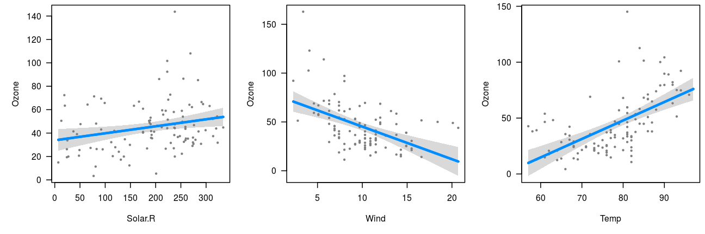

---
---


Let's begin with a simple, additive, linear model:


```r
fit <- lm(Ozone ~ Solar.R + Wind + Temp, data=airquality)
summary(fit)$coef
```

```
##                 Estimate  Std. Error   t value     Pr(>|t|)
## (Intercept) -64.34207893 23.05472435 -2.790841 6.226638e-03
## Solar.R       0.05982059  0.02318647  2.579979 1.123664e-02
## Wind         -3.33359131  0.65440710 -5.094063 1.515934e-06
## Temp          1.65209291  0.25352979  6.516366 2.423506e-09
```

As the summary indicates, temperature has a clear positive effect on ozone, wind has a clear negative effect, and solar radiation has a more subtle effect: somewhat positive but could be due to random chance.  Visual summaries are often more informative and clear than numerical summaries.  Let's see what `visreg` provides:


```r
par(mfrow=c(1,3))
visreg(fit)
```



If you're looking at the plots interactively in something like RStudio, you can click through the plots one by one.  You can also recreate these figures indivually with


```r
visreg(fit, "Solar.R")
visreg(fit, "Wind")
visreg(fit, "Temp")
```

The visual summaries reinforce the numeric ones: Temperature has an undeniable positive association with ozone, wind a clear negative association, and the effect of solar radiation is just barely significant.  For example, if we add a horizontal like to the solar radiation plot:


```r
visreg(fit, "Solar.R")
abline(h=44.5, lty=2)
```


we can see that the gray band just barely excludes a flat line.

All aspects of the above plot (the blue line, the partial residuals, the band) depend on the specification of not only `Solar.R` but also of all the other terms in the model.  In other words, the result is fully conditional on all components of the predictor; in `visreg`, this type of plot is called a *conditional* plot, and it is the default type.  By default, the other terms in the model are set to their median if the term is numeric or the most common category if the term is a factor.  Changing these defaults is disucssed in [conditioning](conditioning.html).

In addition to continuous explanatory variables, `visreg` also allows the easy visualization of differences between the levels of categorical variables.  The following block of code creates a factor called `Heat` by discretizing `Temp`, and then visualizes its relationship with `Ozone`:


```r
airquality$Heat <- cut(airquality$Temp, 3, labels=c("Cool", "Mild", "Hot"))
fit <- lm(Ozone ~ Solar.R + Wind + Heat, data=airquality)
visreg(fit, "Heat")
```


