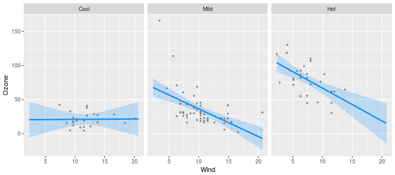

---
---


As was the case with [nonlinear terms](trans.html), the relationship between `x` and `y` in a model with interactions also (typically) depends on multiple coefficients and thus, a visual summary tends to be much more readily understood than a numeric one.

For models with interactions, we must simultaneously visualize the effect of two explanatory variables.  The `visreg` package offers two methods for doing so; this page describes what we call *cross-sectional plots*, which plot one-dimensional relationships between the response and one predictor for several values of another predictor, either in separate panels or [overlaid on top of one another](overlay.html).  The package also provides methods for constructing [*surface plots*](surface.html), which attempt to provide a picture of the regression surface over both dimensions simultaneously.

Let's fit a model that involves an interaction between a continuous term and a categorical term:


```r
airquality$Heat <- cut(airquality$Temp, 3, labels=c("Cool", "Mild", "Hot"))
fit <- lm(Ozone ~ Solar.R + Wind * Heat, data=airquality)
```

We can then use `visreg` to see how the effect of wind on ozone differs depending on the temperature:


```r
visreg(fit, "Wind", by="Heat", layout=c(3,1))
```


Or alternatively, see how the effect of temperature depends on the wind level:


```r
visreg(fit, "Heat", by="Wind", layout=c(3,1))
```


Note that, since `Wind` is a continuous variable, the panels above are somewhat arbitrary.  By default, `visreg` sets up three panels using the 10th, 50th, and 90th percentiles, but [the user can change both the number and the location of these break points](#opt).

By default, `visreg` uses the `lattice` package to lay out the panels.  Thus, in order to change the appearance of these sorts of plots, you may have to read the `lattice` documentation for the relevant options, such as `layout` in the above examples.  Alternatively, you can use [`ggplot2`](gg.html) as the graphics engine by specifying `gg=TRUE`:


```r
visreg(fit, "Wind", by="Heat", gg=TRUE)
```


```r
visreg(fit, "Heat", by="Wind", gg=TRUE)
```


In all of these plots, note that each partial residuals appears exactly once in the plot, in the panel it is closest to.

<a class="anchor" id="opt"></a>

# Options

For a numeric `by` variable, the `breaks` argument controls the values at which the cross-sections are taken. By default, cross-sections are taken at three quantiles (10th, 50th, and 90th), but a larger number can be specified:


```r
visreg(fit, "Heat", by="Wind", breaks=4, layout=c(4,1))
```


If `breaks` is a vector of numbers, it specifies the values at which the cross-sections are to be taken:


```r
visreg(fit, "Heat", by="Wind", breaks=c(seq(5, 15, 5)), layout=c(3,1))
```


# Graphical options: `lattice`

As mentioned above, when using `lattice` as the graphics engine, the appearance of a plot can typically be changed by specifying the appropriate `lattice` option, which gets passed along by `visreg`.  One exception is the appearance of lines, points, and bands, which are specified [just as they are in base plots](options.html):


```r
visreg(fit, "Wind", by="Heat", layout=c(3,1), fill.par=list(col="#008DFF33"))
```


Another exception is the `strip` option; `visreg` sets up the strip internally, which interferes with the user passing the `strip` option along to `lattice`.  `visreg` does, however, explicitly provide the `strip.names` option:


```r
visreg(fit, "Wind", by="Heat", layout=c(3,1), strip.names=TRUE)
```


You can also explicitly specify the labels for each strip:


```r
visreg(fit, "Wind", by="Heat", layout=c(3,1), strip.names=c("Cold days", "Mild days", "Hot days"))
```


Other aspects of the strip's appearance, such as the background color, can be set with calls to the `lattice` package's `trellis.par.set`:


```r
trellis.par.set(strip.background=list(col="gray90"))
visreg(fit, "Wind", by="Heat", layout=c(3,1))
```


# Graphical options: `ggplot2`

As discussed on the [`ggplot2`](gg.html) page, most `ggplot2` options are specified via additional components to the plot, such as:


```r
visreg(fit, "Wind", by="Heat", gg=TRUE) + theme_bw()
```


The exception, again, is the appearance of points/lines/bands, which are specified with the usual `visreg` arguments:


```r
visreg(fit, "Wind", by="Heat", gg=TRUE, fill.par=list(fill="#008DFF33"))
```


