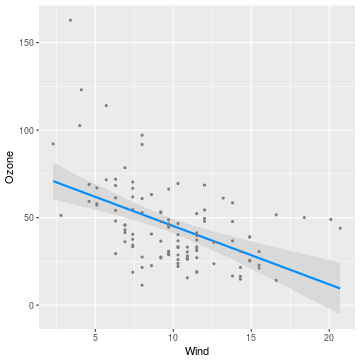
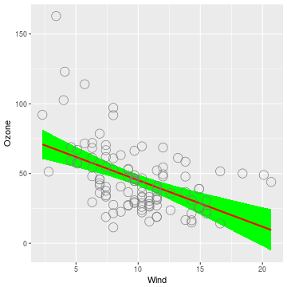
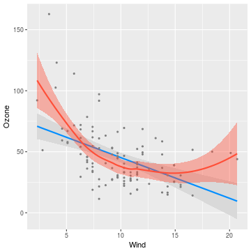
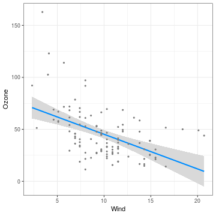

---
---


By default, `visreg` will use base R graphics as the engine; however, you also have the option of using `ggplot2` as the engine.  For example:


```r
fit <- lm(Ozone ~ Solar.R + Wind + Temp, data=airquality)
visreg(fit, "Wind", gg=TRUE)
```



[Graphical options](options) regarding the appearance of points, lines, and bands are specified in the same way as with base R:


```r
visreg(fit, "Wind", gg=TRUE, line=list(col="red"),
                             fill=list(fill="green"),
                             points=list(size=5, pch=1))
```



Note that `visreg` returns a `gg` object, and therefore, you can use `ggplot2` to add additional layers to the graph.  For example, we could add a smoother:


```r
visreg(fit, "Wind", gg=TRUE) + geom_smooth(method="loess", col='#FF4E37', fill='#FF4E37')
```



Or we could modify the theme:


```r
visreg(fit, "Wind", gg=TRUE) + theme_bw()
```


