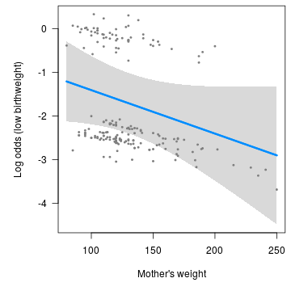
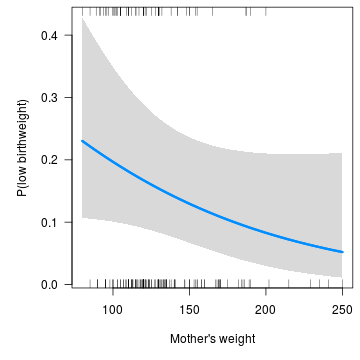

---
---


Generally speaking, visreg works the same way for GLMs as with any other model:


```r
data("birthwt", package="MASS")
fit <- glm(low ~ age + race + smoke + lwt, data=birthwt, family="binomial")
visreg(fit, "lwt", xlab="Mother's weight", ylab="Log odds (low birthweight)")
```



<a class="anchor" id="scale"></a>

# Scale

The unique aspect of GLMs is the link function joining the linear predictors to the response -- note that the vertical axis in the above plot is the log-odds of the outcome, not low birthweight itself.  This is the best scale on which to examine residuals and modeling assumption, because, in a sense, it is the scale on which the modeling actually takes place (Mother's weight is assumed to have a linear form in the model, and the above plot is linear).

For communicating modeling results, however, it is often useful to transform the above outcome to the probability scale.  This can be done by manually specifying `trans` as described in [transformations](trans.html), although for GLMs the shortcut `scale="response"` is provided:


```r
visreg(fit, "lwt", scale="response", rug=2, xlab="Mother's weight", ylab="P(low birthweight)")
```



# Partial residuals

Note that by default, `visreg` switches to a rug display rather than show residuals when a transformation has been applied to the vertical axis.  The reason for this is that residuals are useful to examine on the linear predictor scale, but can be misleading when transformed -- a moderate residual can appear huge after a transformation, and vice versa.

To illustrate, suppose we generate some data from a Poisson distribution using a log link:


```r
n <- 50
x <- seq(-5, 5, len=n)
y <- rpois(n, lambda = exp(x))
```

create an artificial outlier:


```r
y[which.max(x)] <- 0
```

then fit a Poisson regression model:


```r
fit <- glm(y ~ x, family=poisson)
```

and visualize with `visreg`:


```r
par(mfrow=c(1,3))
visreg(fit, "x")
visreg(fit, "x", scale="response")
visreg(fit, "x", scale="response", partial=TRUE)
```


The default `visreg` plot (left) clearly illustrates that 49 of the observations fit the model well, but the 50th is a big outlier.  By transforming to the response scale, we can see the exponential relationship between `x` and `y`.  The third plot, however, is misleading -- not only does it indicate that there are several large positive outliers, but it obscures the one actual outlier.

It is worth mentioning that `visreg` uses deviance residuals for GLMs and Cox proportional hazards models; these are the most symmetric residuals, and thus, most useful for visually assessing problems with fit.
