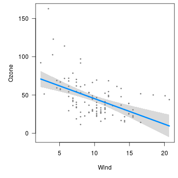
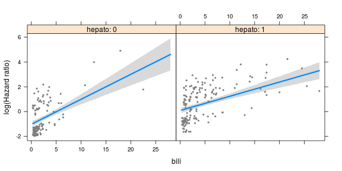
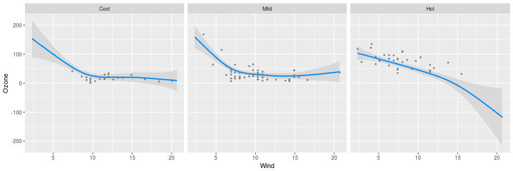

---
---


`visreg` is an R package for displaying the results of a fitted model in terms of how a predictor variable `x` is estimated to affect an outcome `y`.  The implementation of `visreg` takes full advantage of object-oriented programming in R, meaning that it works with virtually any type of (formula-based) model class in R provided that the model class provides a `predict` method.

This site focuses mainly on illustrating the ideas and syntax of `visreg` as a way of providing online documentation.  For more on the mathematical/statistical details of `visreg`, see the original article:

* [Breheny P and Burchett W (2017).  Visualization of Regression Models Using visreg. *The R Journal*, 9: 56-71](https://journal.r-project.org/archive/2017/RJ-2017-046/index.html).

# Installation

`visreg` is on CRAN, so it can be installed via:


```r
install.packages("visreg")
```

# Quick start guide

The basic idea of `visreg` is that you fit some type of model, then pass that model to visreg to be plotted:


```r
fit <- lm(Ozone ~ Solar.R + Wind + Temp, data=airquality)
visreg(fit, "Wind")
```



The result is a plot of how the expected value of the outcome (Ozone) changes as a function of `x` (Wind), with all other variables in the model held fixed.

A `visreg` plot includes (1) the expected value (blue line) (2) a confidence interval for the expected value (gray band), and (3) partial residuals (dark gray dots).  

Again, this works with any kind of model, not just linear regression models.  Here is a Cox proportional hazards model with an interaction:


```r
library(survival)
fit <- coxph(Surv(time, status!=0) ~ bili*hepato, data=pbc)
visreg(fit, "bili", "hepato", ylab="log(Hazard ratio)")
```



In this plot, we see how the hazard changes as a function of bilirubin levels for patients with/without an enlarged liver.  For more on this type of plot, see [Cross-sectional plots](cross.html).  

<a id="gam" class="anchor"></a>

The models do not have to be linear, and we have the option of using `ggplot2` as the graphics engine:


```r
library(mgcv)
airquality$Heat <- cut(airquality$Temp, 3, labels=c("Cool", "Mild", "Hot"))
fit <- gam(Ozone ~ s(Wind, by=Heat, sp=0.1), data=airquality)
visreg(fit, "Wind", "Heat", gg=TRUE, ylab="Ozone")
```



For more on using `visreg` with `ggplot2`, see [Visreg and ggplot2](gg.html).

A number of options for [surface plots](surface.html) are also provided, such as `rgl` plots:


```r
library(splines)
fit <- lm(Ozone ~ Solar.R +ns(Wind, df=2)*ns(Temp, df=2), data=airquality)
visreg2d(fit, "Wind", "Temp", plot.type="rgl")
```

<div class="container" style="width: 100%">
  <div class="row-fluid">
    <iframe class="span12" 
	    style="border: none; height: 484px; width: 100%"
	    src="img/rgl.html">
    </iframe>
  </div>
</div>

If your browser supports WebGL, you should be able to interact with the above plot, rotating it around to explore the surface.

