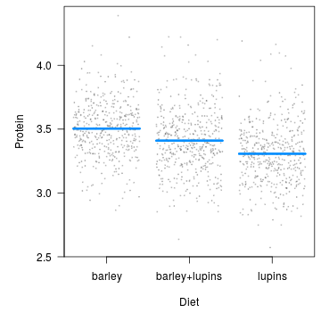
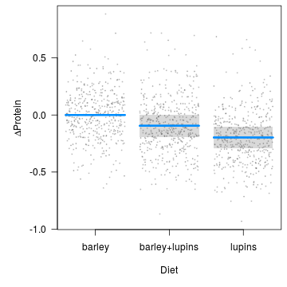
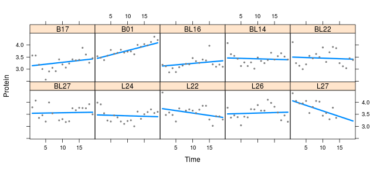

---
---


`visreg` can be used with mixed models, for example from the `nlme` or `lme4` packages, although it is worth noting that these packages are unable to incorporate uncertainty about random effects into predictions, and therefore do not offer confidence intervals, meaning that `visreg` plots will lack confidence bands.  Nevertheless, `visreg` is still useful for visualizing the effects of fixed effects in such models using contrast plots, as well as plotting effects without confidence intervals.

As an illustration, consider the following random-intercept, random-slope model from a study involving the protein content of cows' milk in the weeks following calving:


```r
library(lme4)
data(Milk, package="nlme")
fit <- lmer(protein ~ Diet + Time + (Time|Cow), Milk)
```

```
## Warning in checkConv(attr(opt, "derivs"), opt$par, ctrl = control$checkConv, :
## Model failed to converge with max|grad| = 0.00501538 (tol = 0.002, component 1)
```

# Plotting fixed effects

As mentioned above, a conditional plot will lack confidence bands (due to the large number of points, we're making the partial residuals smaller and partially transparent):


```r
visreg(fit, "Diet", ylab="Protein", points=list(col="#55555540", cex=0.25))
```



But, because the random effect terms drop out of a contrast plot, we do have bands here:


```r
visreg(fit, "Diet", type="contrast", ylab=expression(Delta*'Protein'), 
       points=list(col="#55555540", cex=0.25))
```



# Plotting random effects

The `visreg` package can also be used to plot random effects, although again, the plots will not include intervals.  Below, we plot the modeled relationship between protein content and time for each cow.  Two aspects of the code are worth pointing out:

* According to the object-oriented design of `visreg`, the `predict` method supplied by `lme4` is used.  It has its own option, `re.form`, to control how random effects are used in the prediction, and this must be passed through `visreg` accordingly.
* For the sake of space, I'm going to subset the plot to ten cows rather than all 79.  This can be accomplished by returning, then subsetting, the raw `visreg` object prior to plotting.


```r
v <- visreg(fit, "Time", by="Cow", re.form=~(Time|Cow), plot=FALSE)
subCow <- sample(levels(Milk$Cow), 10)
vv <- subset(v, Cow %in% subCow)
plot(vv, ylab="Protein", layout=c(5,2))
```



Returning the data frames, estimates, confidence intervals, and residuals used in the construction of its plots like this allows users to write their own extensions and modifications of `visreg` plots.
