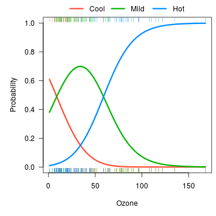
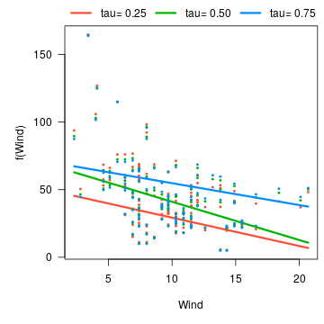
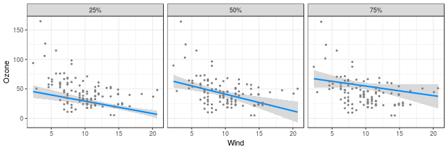

---
---


Multiple `visreg` objects can be bundled together in an object of class `visregList`; for example, when you submit `visreg(fit)`, you get a `visregList`, one `visreg` object for each predictor in the model.  `visregList`s can also be used for handling models with multiple outcomes.

For example, suppose we fit a multinomial regression model using the `nnet` package:


```r
library(nnet)
airquality$Heat <- cut(airquality$Temp,3,labels=c("Cool","Mild","Hot"))
fit <- multinom(Heat ~ Wind + Ozone, airquality)
```

By default, `visreg(fit, "Ozone")` would create three separate plots, one for each level of the outcome, `Heat`.  By specifying `collapse=TRUE`, we collapse the list down to a single `visreg` object which can be plotted using the [methods](cross.html) [described](overlay.html) [here](surface.html).  For example:


```r
visreg(fit, "Ozone", collapse=TRUE, overlay=TRUE, ylab="Probability",
       ylim=c(0,1), partial=FALSE, rug=2)
```



Another example is quantile regression using the `quantreg` package.  Here, there is only one outcome, but we could be interested in modeling several different quantiles.  The `collapse` option is used similarly here:


```r
library(quantreg)
fit <- rq(Ozone ~ Wind + Temp, tau=c(.25, .5, .75), data=airquality)
v <- visreg(fit, "Wind", overlay=TRUE, collapse=TRUE)
```



NOTE: `quantreg` does not return standand errors if you specify multiple quantiles of interest.  To obtain them, you must construct the `visregList` manually:


```r
fit1 <- rq(Ozone ~ Wind + Temp, tau=.25, data=airquality)
fit2 <- rq(Ozone ~ Wind + Temp, tau=.5, data=airquality)
fit3 <- rq(Ozone ~ Wind + Temp, tau=.75, data=airquality)
v <- visregList(visreg(fit1, "Wind", plot=FALSE),
                visreg(fit2, "Wind", plot=FALSE),
                visreg(fit3, "Wind", plot=FALSE),
                labels=c("25%", "50%", "75%"), collapse=TRUE)
plot(v, ylab="Ozone", gg=TRUE) + theme_bw()
```



Notice the use of the `labels` argument to label the elements of the list.
