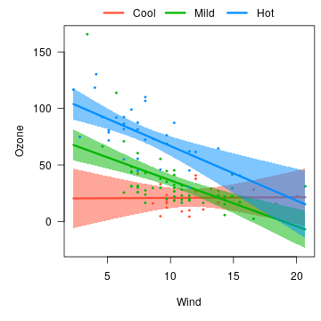
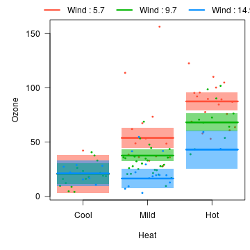
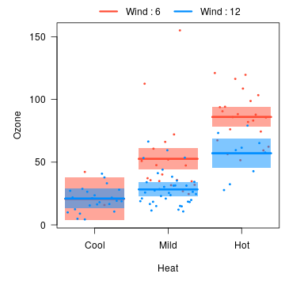
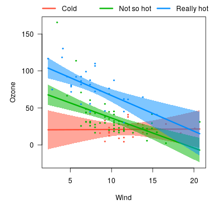
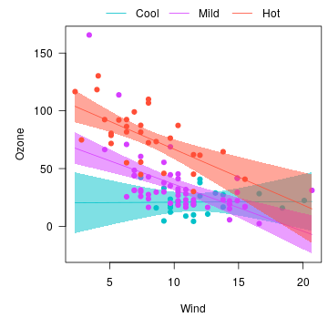

---
---


The default [cross-sectional plot](cross.html) places the different cross-sections in separate panels.  Occasionally, it is more helpful to overlay the plots on top of one another to see more directly how they compare.  Using the same model as [before](cross.html):


```r
airquality$Heat <- cut(airquality$Temp, 3, labels=c("Cool", "Mild", "Hot"))
fit <- lm(Ozone ~ Solar.R + Wind * Heat, data=airquality)
```

We can specify `overlay=TRUE` to obtain a version of the plot in which all the images are overlaid:


```r
visreg(fit, "Wind", by="Heat", overlay=TRUE)
```




```r
visreg(fit, "Heat", by="Wind", overlay=TRUE)
```



The options described in [cross-sectional plots](cross.html) work in the same way here.  For example,


```r
visreg(fit, "Heat", by="Wind", overlay=TRUE, breaks=c(6, 12))
```



In particular, the option `strip.names` is used in the same way for consistency, even though there are no actual strips in an overlay plot:


```r
visreg(fit, "Wind", by="Heat", overlay=TRUE, strip.names=c("Cold", "Not so hot", "Really hot"))
```



Changing the appearance of lines, etc., is accomplished in a similar manner to [other `visreg` plots](options.html), although (1) you need to pass a vector to specify the appearance for differeny `by` levels and (2) you need to be sure that you're correctly matching the colors of lines, points, and bands:


```r
visreg(fit, "Wind", by="Heat", overlay=TRUE,
       line=list(col=c("#00C1C9", "#D63EFF", "#FF4E37"), lwd=1),
       fill=list(col=c("#00C1C980", "#D63EFF80", "#FF4E3780")),
       points=list(col=c("#00C1C9", "#D63EFF", "#FF4E37"), cex=1))
```



Note that you can still pass parameters as single elements (`cex=1`); these will apply to all levels of `by`.
