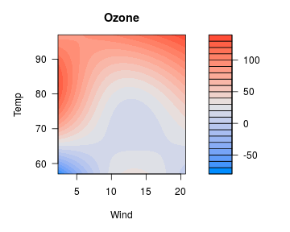
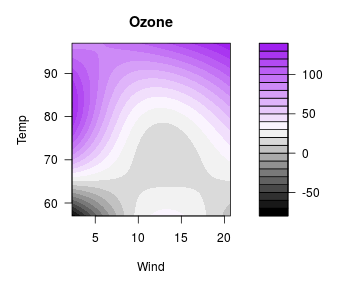
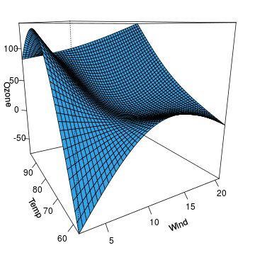

---
---


Suppose we have a model with a complicated interaction between two continuous variables:


```r
library(splines)
fit <- lm(Ozone ~ Solar.R +ns(Wind, df=2)*ns(Temp, df=2), data=airquality)
```

We might wish to visualize how ozone depends on wind and temperature as a continuous regression surface.  `visreg2d` provides two main options for this, filled contour plots and perspective plots.

# Filled contour plots

The default is to provide a contoured image plot:


```r
visreg2d(fit, "Wind", "Temp")
```



Here, wind and temperature are laid out on a two-dimensional grid, and colors are used to represent the level of ozone.  A legend is provided to the left.  R's `filled.contour` function is used to generate the plot, so if you wish to change any options, you will need to look at `?filled.contour` to see the correct syntax.  For example, if we want different colors,


```r
visreg2d(fit, "Wind", "Temp", color.palette=colorRampPalette(c("black", "white", "purple")))
```



# Perspective plots

The other option provided by `visreg2d` is to represent the surface as a three-dimensional image.  This can be done in a static manner using `type="persp"`:


```r
visreg2d(fit, "Wind", "Temp", plot.type="persp")
```



Or dynamically using `type="rgl"`:


```r
visreg2d(fit, "Wind", "Temp", plot.type="rgl")
```

<div class="container" style="width: 100%">
  <div class="row-fluid">
    <iframe class="span12" 
	    style="border: none; height: 484px; width: 100%"
	    src="img/rgl.html">
    </iframe>
  </div>
</div>

For the interactive `rgl` option, you will need to install the `rgl` package first.
